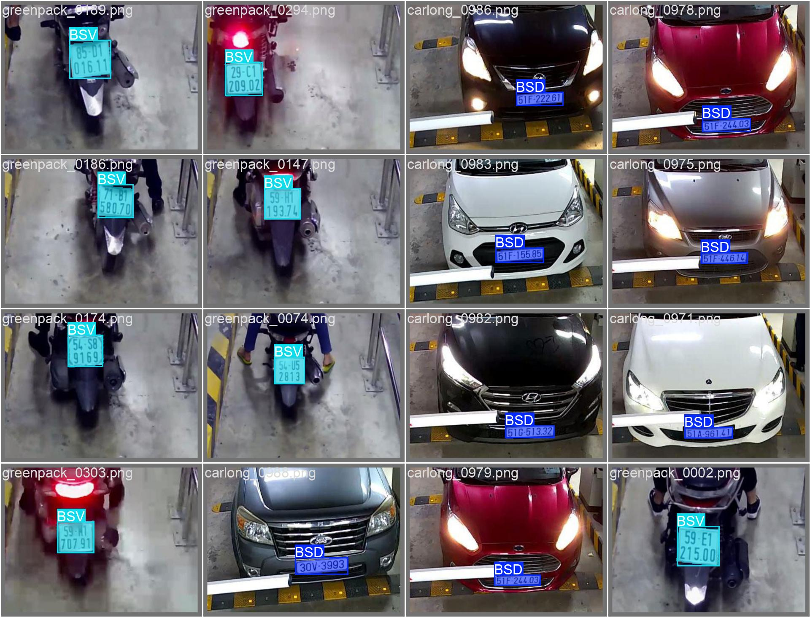

# VN-LICENSE-SEG - Vietnamese License Plate Segmentation

Dự án phân đoạn biển số xe Việt Nam sử dụng YOLO11 Segmentation Model.

## 📋 Tổng quan

Dự án này sử dụng mô hình YOLO11 để phân đoạn (segmentation) biển số xe Việt Nam với độ chính xác cao. Mô hình được huấn luyện để nhận diện và phân đoạn 2 loại biển số:
- **BSD**: 1-line number plates
- **BSV**: 2-line number plates

## 🎯 Kết quả đạt được

### Mô hình PyTorch (.pt)
- **mAP50-95**: 0.8627
- **mAP50**: 0.9936
- **mAP75**: 0.9793
- **Latency**: 12.86 ms
- **FPS**: 77.78
- **Model**: `runs/segment/train/weights/best.pt`

### Mô hình ONNX
- **mAP50-95**: 0.8619
- **mAP50**: 0.9934
- **mAP75**: 0.9778
- **Latency**: 9.29 ms
- **FPS**: 107.60
- **Model**: `runs/segment/train/weights/best.onnx`

> **Lưu ý**: Mô hình ONNX có độ trễ thấp hơn và tốc độ xử lý cao hơn so với mô hình PyTorch, phù hợp cho triển khai production.

## 📁 Cấu trúc dự án

```
VN-LICENSE-SEG/
├── dataset/
│   ├── images/
│   │   ├── train/      # Ảnh huấn luyện
│   │   └── val/        # Ảnh validation
│   ├── labels/         # Nhãn segmentation
│   └── dataset.yaml    # Cấu hình dataset
├── runs/
│   └── segment/
│       ├── train/      # Kết quả huấn luyện
│       │   └── weights/
│       │       ├── best.pt    # Mô hình PyTorch tốt nhất
│       │       └── best.onnx  # Mô hình ONNX
│       └── val/        # Kết quả validation
├── train.py           # Script huấn luyện
├── evaluate.py        # Script đánh giá
├── export_onnx.py     # Script export sang ONNX
├── benchmark.py       # Script benchmark hiệu năng
├── data.yaml          # Cấu hình dataset
└── requirements.txt   # Dependencies
```

## 🚀 Cài đặt

### Yêu cầu hệ thống
- Python 3.8+
- CUDA (khuyến nghị cho GPU)

### Cài đặt dependencies

```bash
pip install -r requirements.txt
```

## 📖 Hướng dẫn sử dụng

### 1. Huấn luyện mô hình

```bash
python train.py --model yolo11n-seg.pt --data data.yaml --epochs 50
```

**Tham số:**
- `--model`: Đường dẫn đến mô hình pre-trained (ví dụ: `yolo11n-seg.pt`, `yolo11s-seg.pt`)
- `--data`: Đường dẫn đến file cấu hình dataset (`data.yaml`)
- `--epochs`: Số epoch huấn luyện (mặc định: 50)

### 2. Đánh giá mô hình

```bash
python evaluate.py --model runs/segment/train/weights/best.pt --data data.yaml
```

**Kết quả sẽ hiển thị:**
- mAP50-95: Mean Average Precision từ IoU 0.5 đến 0.95
- mAP50: Mean Average Precision tại IoU 0.5
- mAP75: Mean Average Precision tại IoU 0.75

### 3. Export sang ONNX

```bash
python export_onnx.py --weights runs/segment/train/weights/best.pt
```

Mô hình ONNX sẽ được lưu tại `runs/segment/train/weights/best.onnx`

### 4. Benchmark hiệu năng

```bash
python benchmark.py --model runs/segment/train/weights/best.pt --image dataset/images/val/carlong_0004.png --runs 100
```

**Tham số:**
- `--model`: Đường dẫn đến mô hình (.pt hoặc .onnx)
- `--image`: Đường dẫn đến ảnh test
- `--runs`: Số lần chạy để tính trung bình (mặc định: 100)

## 📊 Ví dụ kết quả



## 🔧 Cấu hình Dataset

File `data.yaml` chứa cấu hình dataset:

```yaml
train: dataset/images/train/
val: dataset/images/val/
nc: 2
names: ['BSD', 'BSV']
```

- `train`: Thư mục chứa ảnh huấn luyện
- `val`: Thư mục chứa ảnh validation
- `nc`: Số lượng classes
- `names`: Tên các classes


## 🛠️ Công nghệ sử dụng

- **Framework**: Ultralytics YOLO11
- **Model**: YOLO11 Segmentation
- **Format**: PyTorch (.pt), ONNX
- **Input size**: 640x640 pixels

## 📝 Ghi chú

- Mô hình được huấn luyện với batch size 32, image size 640x640
- Sử dụng close_mosaic=20 để cải thiện chất lượng mô hình
- Mô hình ONNX được export với opset=12, simplify=True

## 📄 License

Dự án này sử dụng Ultralytics YOLO11 framework.

## 👥 Đóng góp

Mọi đóng góp và đề xuất đều được chào đón!

