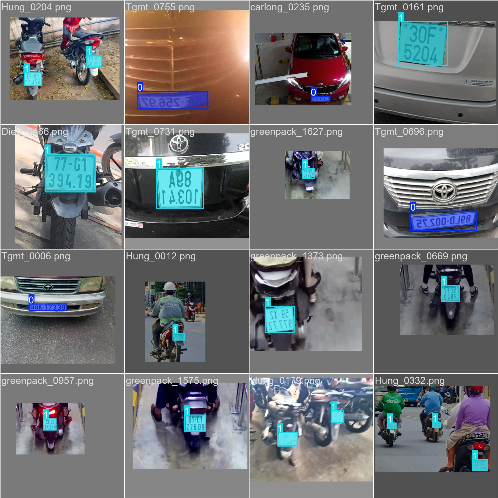

# VN-LICENSE-SEG

Vietnamese License Plate Segmentation using YOLO11. This project evaluates models in multiple formats: PyTorch (.pt), ONNX (with ONNX Runtime GPU), and TensorRT (.engine) with different optimization settings.

## Project Overview

This project provides a complete pipeline for training, exporting, and benchmarking YOLO11 segmentation models for Vietnamese license plate detection. Models are evaluated with different configurations to find optimal performance-latency trade-offs.

## Project Structure

```
VN-LICENSE-SEG/
├── dataset/                    # Training and validation data
│   ├── images/
│   │   ├── train/             # Training images
│   │   └── val/               # Validation images
│   ├── labels/                # YOLO segmentation labels
│   └── dataset.yaml           # Dataset configuration
├── demo/                       # Demo images for testing
├── runs/                       # Training outputs and validation results
├── benchmark/                  # Benchmark results
│   └── results.csv            # Performance metrics
├── train.py                    # Training script
├── export.sh                   # Model export script
├── benchmark.sh                # Benchmarking script
└── requirements.txt            # Dependencies
```

## Quick Start

Run the complete pipeline in order:

### 1. Train the Model
```bash
python train.py
```
Trains YOLO11 segmentation model and saves weights to `runs/segment/train/weights/best.pt`

### 2. Export Models
```bash
chmod +x ./export.sh
./export.sh
```
Exports model to multiple formats:
- ONNX (.onnx) - optimized for ONNX Runtime GPU
- TensorRT (.engine) - optimized for TensorRT inference

### 3. Run Benchmarks
```bash
chmod +x ./benchmark.sh
./benchmark.sh
```
Evaluates all models and saves metrics to `benchmark/results.csv`

## Demo



## Benchmark Results

Performance comparison across different model formats and optimization settings:

| Model Format | Configuration | mAP50-95 | mAP50 | mAP75 | Latency (ms) | FPS | VRAM (MB) |
|---|---|---|---|---|---|---|---|
| PyTorch | best.pt | 0.8664 | 0.9936 | 0.9757 | 14.18 | 70.54 | 71.89 |
| ONNX | simplify=False, fp16=False, int8=False | 0.8638 | 0.9935 | 0.9732 | 10.76 | 92.90 | 47.72 |
| ONNX | simplify=True, fp16=False, int8=False | 0.8638 | 0.9935 | 0.9732 | 11.12 | 89.97 | 47.72 |
| ONNX | simplify=True, fp16=True, int8=False | 0.8688 | 0.9936 | 0.9739 | 10.86 | 92.10 | 42.30 |
| TensorRT | simplify=False, fp16=False, int8=False | 0.8637 | 0.9935 | 0.9732 | 9.06 | 110.31 | 57.47 |
| TensorRT | simplify=True, fp16=False, int8=False | 0.8637 | 0.9935 | 0.9732 | 8.97 | 111.46 | 57.47 |
| TensorRT | simplify=True, fp16=True, int8=False | 0.8639 | 0.9935 | 0.9732 | 7.80 | 128.18 | 57.47 |

### Key Findings

- **Best Accuracy**: ONNX with FP16 optimization (mAP50-95: 0.8688)
- **Fastest Inference**: TensorRT with FP16 optimization (128.18 FPS, 7.80 ms)
- **Memory Efficient**: ONNX with FP16 (42.30 MB VRAM)
- **Recommended**: TensorRT with FP16 for production deployment

